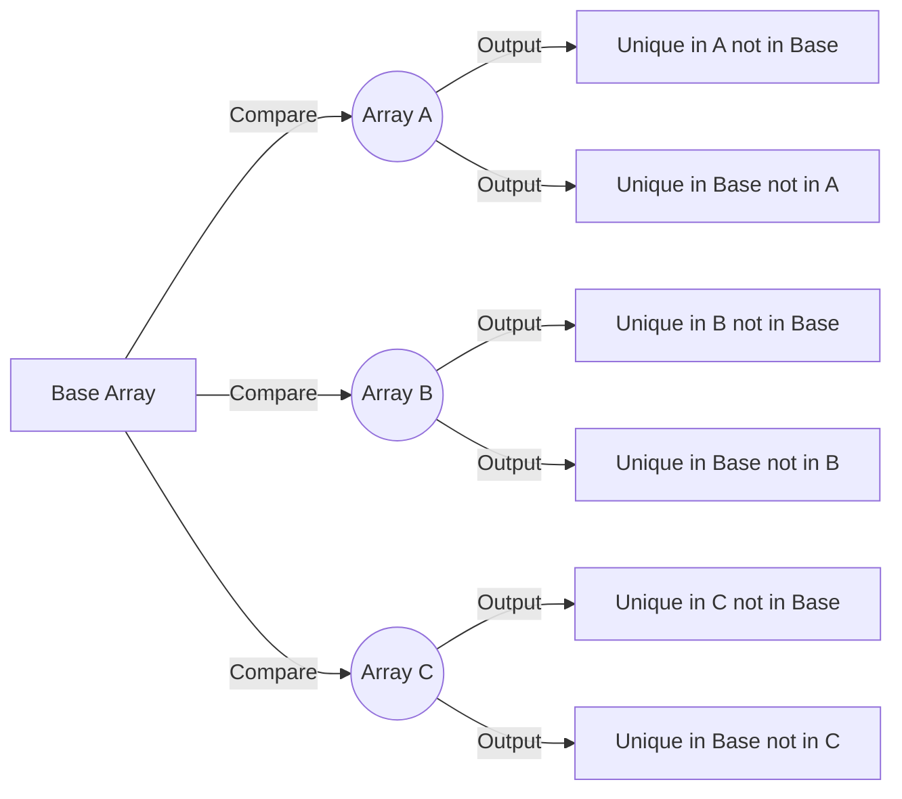

# AzureFunction-MultiFilterArray

[](https://portal.azure.com/#create/Microsoft.Template/uri/https%3A%2F%2Fraw.githubusercontent.com%2Fitweedie%2FAzureFunction-MultiFilterArray%2Fmain%2Fazuredeploy.json)

## Overview

The AzureFunction-MultiFilterArray is an Azure Function designed to compare multiple sets of arrays, identifying unique string values in each set relative to a base set. This function is highly adaptable and can be applied in various contexts where array comparisons are needed, such as data synchronization or filtering distinct values across datasets.

## Functionality

- Input: JSON payload containing a base array and one or more arrays to compare.
- Processing: The function compares each input array against the base array, determining:
  - Values present in the input array but not in the base.
  - Values present in the base but not in the input array.
- Output: A JSON response listing unique values for each compared array.

## Process Flow Diagram



## Deployment from GitHub to Azure Functions

### Quick Deploy (Recommended)

Click the "Deploy to Azure" button above for one-click deployment. This will:
- Create all necessary Azure resources (Function App, Storage Account, Hosting Plan)
- Deploy the function code automatically
- Configure the runtime environment

**Note**: You'll need to replace `YOUR_USERNAME` in the Deploy to Azure button URL with your actual GitHub username.

### Manual Deployment Steps

### Prerequisites

- Azure Account: An active Azure account. Sign up here if you don't have one.
- GitHub Account: Your source code should be hosted on GitHub.
- Azure Functions Core Tools: Install these if you intend to test locally, available here.

### Steps

1. Create a Function App in Azure
   - Navigate to the Azure Portal.
   - Create a new Function App:
     - Choose your subscription and resource group.
     - Select a unique name.
     - Choose Node.js as the runtime stack.
     - Select a region close to your user base.

3. Configure Deployment Source
   - In your Function App on the Azure Portal, go to Deployment Center.
   - Choose GitHub as the source, then authorize Azure to access your GitHub account.
   - Select the repository and branch containing your function's code.

4. Deploy
   - Azure automatically deploys the latest code from the specified branch.
   - Monitor the deployment under Deployment Center in the Azure Portal.

5. Testing
   - After deployment, test the function through the Azure portal's Functions menu or using external tools like Postman.

## Sample POST Request

Here is what a sample POST request might look like:

```json
{
    "base": [
        { "value": "value1" },
        { "value": "value2" }
    ],
    "check": [
        {
            "checkName": "ArrayA",
            "checkValues": [
                { "value": "value2" },
                { "value": "value3" }
            ]
        },
        {
            "checkName": "ArrayB",
            "checkValues": [
                { "value": "value4" },
                { "value": "value5" }
            ]
        }
    ]
}
```

## Expected JSON Response

The response for the above request would look like this:

```json
{
    "ArrayA": {
        "inCheckNotInBase": [
            { "value": "value3" }
        ],
        "inBaseNotInCheck": [
            { "value": "value1" }
        ]
    },
    "ArrayB": {
        "inCheckNotInBase": [
            { "value": "value4" },
            { "value": "value5" }
        ],
        "inBaseNotInCheck": [
            { "value": "value1" },
            { "value": "value2" }
        ]
    }
}
```

## Conclusion

AzureFunction-MultiFilterArray provides a scalable and efficient solution for comparing multiple arrays, suitable for a variety of applications from data synchronization to auditing data discrepancies.
