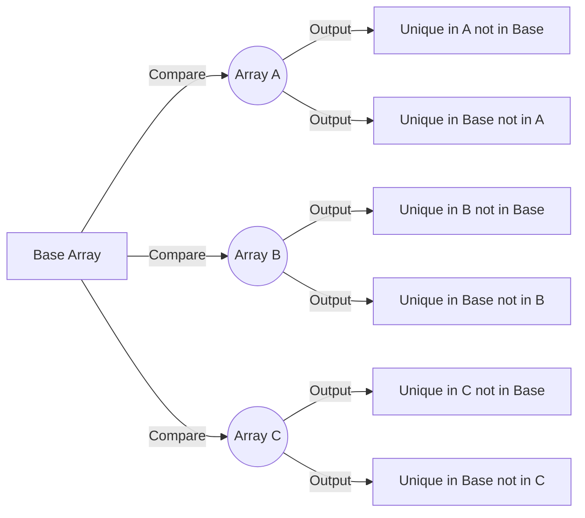

# AzureFunction-MultiFilterArray

[](https://portal.azure.com/#create/Microsoft.Template/uri/https%3A%2F%2Fraw.githubusercontent.com%2Fitweedie%2FAzureFunction-MultiFilterArray%2Fmain%2Fazuredeploy.json)

## Overview

The AzureFunction-MultiFilterArray is an Azure Function designed to compare multiple sets of arrays, identifying unique string values in each set relative to a base set. This function is highly adaptable and can be applied in various contexts where array comparisons are needed, such as data synchronization, filtering distinct values across datasets, email list comparisons, and data validation workflows.

## How This Function Works

This Azure Function provides two main endpoints that perform array comparison operations:

### Core Functionality

1. **Input Processing**: The function accepts a JSON payload containing:
   - A `base` array containing reference objects with `value` properties
   - A `check` array containing one or more named arrays to compare against the base

2. **Comparison Logic**: For each check array, the function performs a bidirectional comparison:
   - Identifies values present in the check array but NOT in the base array
   - Identifies values present in the base array but NOT in the check array

3. **Output Generation**: Returns a structured JSON response with results for each comparison, maintaining the original object structure

### Available Endpoints

- **`/api/filterArray`** - General-purpose array comparison for any string values
- **`/api/emailArray`** - Specialized for email address comparisons (same logic, optimized for email use cases)

### What This Function Will Do

- **Data Synchronization**: Compare datasets to identify missing or extra records
- **Email List Management**: Find differences between email lists for marketing campaigns
- **Inventory Management**: Compare product lists across different systems
- **User Access Control**: Compare user lists between different platforms
- **Data Validation**: Verify data consistency across multiple sources
- **Audit and Compliance**: Track changes and differences in datasets

## Getting Started

### Prerequisites

Before using this Azure Function, ensure you have:

- **Azure Account**: An active Azure subscription
- **Function App**: A deployed Azure Function App with Node.js runtime
- **API Client**: Tool for making HTTP requests (Postman, curl, Power Automate, etc.)
- **Basic JSON Knowledge**: Understanding of JSON structure for request/response handling

### Quick Start Guide

1. **Deploy the Function** using the "Deploy to Azure" button above
2. **Get your Function URL** from the Azure Portal (see Deployment Instructions below)
3. **Test the Function** using the sample requests provided
4. **Integrate** with your applications using the provided Swagger specification

## Supported Operations

### POST /api/filterArray
**Purpose**: General array comparison for any string values

**Request Format**:
```json
{
    "base": [
        { "value": "item1" },
        { "value": "item2" }
    ],
    "check": [
        {
            "checkName": "ArrayA",
            "checkValues": [
                { "value": "item2" },
                { "value": "item3" }
            ]
        }
    ]
}
```

**Response Format**:
```json
{
    "ArrayA": {
        "inCheckNotInBase": [
            { "value": "item3" }
        ],
        "inBaseNotInCheck": [
            { "value": "item1" }
        ]
    }
}
```

### POST /api/emailArray
**Purpose**: Specialized for email address comparisons

**Request Format**: Same as filterArray but optimized for email values
**Response Format**: Same structure with email-specific processing

### GET Requests
Both endpoints support GET requests for testing purposes, returning sample data.

## Obtaining Credentials

### Function Key (Recommended)
1. Navigate to your Function App in the Azure Portal
2. Go to **Functions** → Select your function → **Function Keys**
3. Copy the `default` key or create a new one
4. Use in URL: `https://yourapp.azurewebsites.net/api/filterArray?code=YOUR_FUNCTION_KEY`

### Access Keys (Alternative)
1. In your Function App, go to **Settings** → **Keys**
2. Copy the **Host Key** or **Master Key**
3. Use the same URL format with the host key

### Authentication Levels
- **Function Level**: Requires function-specific key (default)
- **Anonymous**: No authentication required (not recommended for production)
- **Admin**: Requires master key access

## Known Issues and Limitations

### Current Limitations
- **Array Size**: Large arrays (>10,000 items) may experience slower performance
- **Memory Usage**: Very large datasets may hit memory limits in Consumption plan
- **Object Structure**: Input objects must have a `value` property; other structures not supported
- **Data Types**: Only string comparisons are supported; numbers and other types need string conversion
- **Timeout**: Functions on Consumption plan have a 5-minute execution limit

### Known Issues
- **Case Sensitivity**: Comparisons are case-sensitive ("Email" ≠ "email")
- **Whitespace**: Leading/trailing whitespace is preserved and affects comparisons
- **Unicode**: Special characters and Unicode symbols may cause unexpected results in some scenarios
- **Null Values**: Null or undefined values in arrays may cause errors

### Workarounds
- **Large Datasets**: Consider splitting large arrays into smaller batches
- **Case Issues**: Normalize data to lowercase before sending
- **Whitespace**: Trim strings in your client application before sending
- **Performance**: Use Premium or Dedicated hosting plans for better performance

## Deployment Instructions

### Method 1: Quick Deploy (Recommended)
1. Click the **"Deploy to Azure"** button at the top of this README
2. Fill in the required Azure resource information
3. Wait for deployment to complete
4. Get your function URL (see step 4 below)

### Method 2: Manual Deployment

#### Step 1: Create Function App
1. Log into the [Azure Portal](https://portal.azure.com)
2. Create a new **Function App** with these settings:
   - **Runtime**: Node.js
   - **Version**: 18 LTS or later
   - **Hosting Plan**: Consumption (Y1) for cost-effectiveness
   - **Storage**: Create new or use existing

#### Step 2: Deploy Code
1. In your Function App, go to **Deployment Center**
2. Choose **GitHub** as source
3. Authorize and select this repository
4. Select the `main` branch
5. Azure will automatically build and deploy

#### Step 3: Verify Deployment
1. Go to **Functions** in your Function App
2. You should see `filterArray` and `emailArray` functions listed
3. Click on each function to verify they're running

#### Step 4: Get Function URL
1. In your Function App, navigate to **Functions**
2. Click on `filterArray` (or `emailArray`)
3. Click **"Get Function Url"**
4. Copy the complete URL with the code parameter

**Example Function URL**:
```
https://250630test9.azurewebsites.net/api/filterArray?code=YOUR_FUNCTION_KEY_HERE
```

#### Step 5: Test Your Function
Use a tool like Postman or curl to test:
```bash
curl -X POST "https://yourapp.azurewebsites.net/api/filterArray?code=YOUR_CODE" \
  -H "Content-Type: application/json" \
  -d '{"base":[{"value":"test1"}],"check":[{"checkName":"TestArray","checkValues":[{"value":"test2"}]}]}'
```

### Integration with Power Automate

1. **Import the Swagger File**: Use the `swagger.json` file included in this repository
2. **Create Custom Connector**: In Power Automate, create a new custom connector using the Swagger definition
3. **Configure Authentication**: Use API Key authentication with your function key
4. **Test Connection**: Verify the connector works with sample data
5. **Use in Flows**: Add the custom connector to your Power Automate flows

## Process Flow Diagram



## Sample POST Request

Here is what a sample POST request might look like:

```json
{
    "base": [
        { "value": "value1" },
        { "value": "value2" }
    ],
    "check": [
        {
            "checkName": "ArrayA",
            "checkValues": [
                { "value": "value2" },
                { "value": "value3" }
            ]
        },
        {
            "checkName": "ArrayB",
            "checkValues": [
                { "value": "value4" },
                { "value": "value5" }
            ]
        }
    ]
}
```

## Expected JSON Response

The response for the above request would look like this:

```json
{
    "ArrayA": {
        "inCheckNotInBase": [
            { "value": "value3" }
        ],
        "inBaseNotInCheck": [
            { "value": "value1" }
        ]
    },
    "ArrayB": {
        "inCheckNotInBase": [
            { "value": "value4" },
            { "value": "value5" }
        ],
        "inBaseNotInCheck": [
            { "value": "value1" },
            { "value": "value2" }
        ]
    }
}
```

## Additional Resources

- **Swagger File**: See `swagger.json` for complete API documentation
- **Power Automate**: Use the custom connector created from the Swagger file
- **Azure Documentation**: [Azure Functions Documentation](https://docs.microsoft.com/en-us/azure/azure-functions/)
- **Node.js Runtime**: [Azure Functions Node.js Reference](https://docs.microsoft.com/en-us/azure/azure-functions/functions-reference-node)

## Support and Contributing

For issues, feature requests, or contributions, please visit the GitHub repository. When reporting issues, include:
- Function URL (without the code parameter)
- Sample request data
- Expected vs actual response
- Any error messages from Azure Function logs

## Conclusion

AzureFunction-MultiFilterArray provides a scalable and efficient solution for comparing multiple arrays, suitable for a variety of applications from data synchronization to auditing data discrepancies. With comprehensive documentation and Power Automate integration, it's ready for enterprise use.
